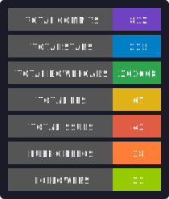
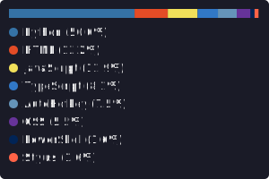
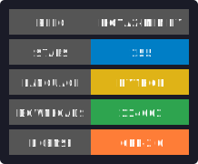
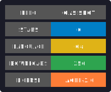
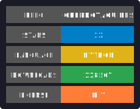
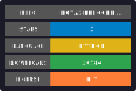
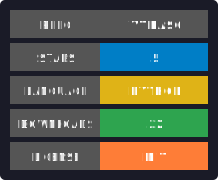
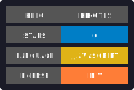
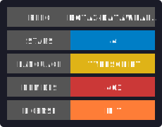
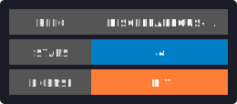

<h1>it's-a me, Ege!</h1>

<h2>stats and some of my work</h2>

<table>
<tr>
<td align="right"></td>
<td align="left"></td>
</tr>
<tr>
<td align="right"></td>
<td align="left"></td>
</tr>
<tr>
<td align="right"></td>
<td align="left"></td>
</tr>
<tr>
<td align="left"></td>
<td align="right"></td>
</tr>
</table>

<h2>contact me at</h2>

